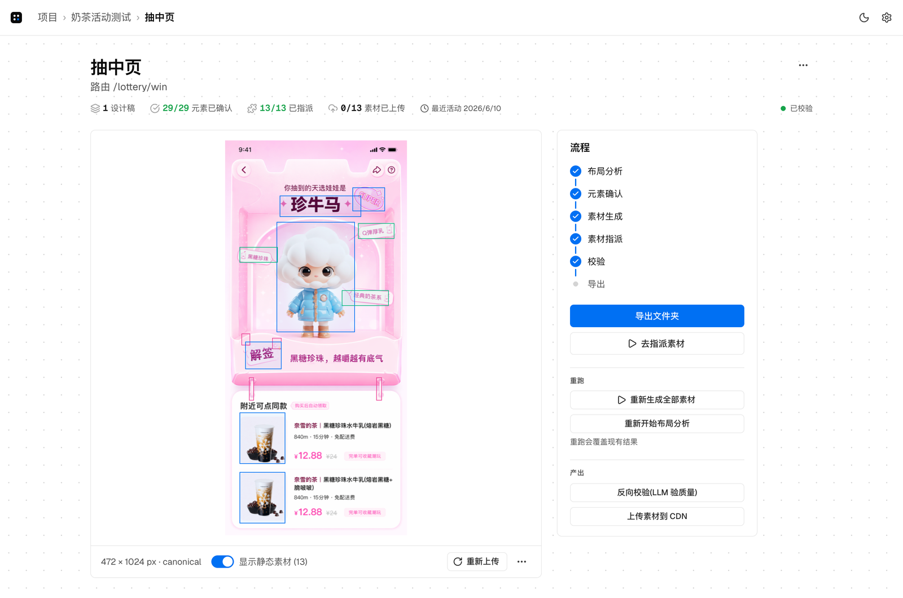
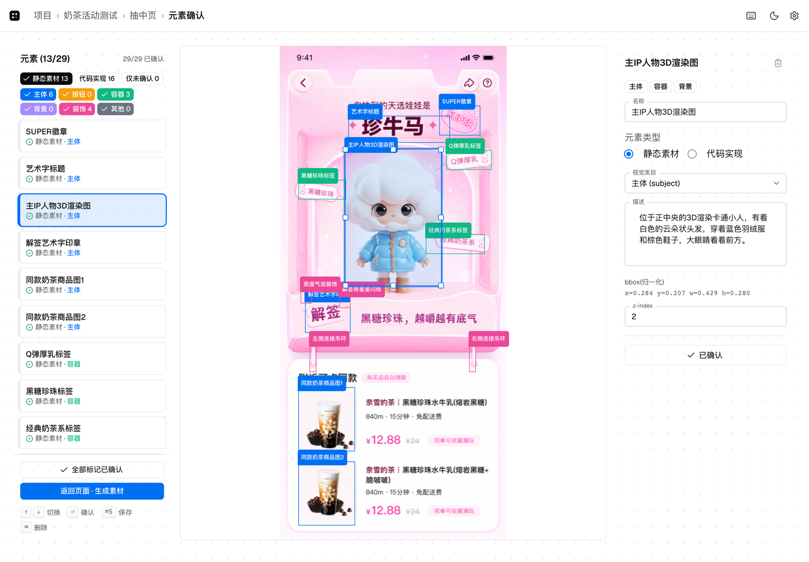
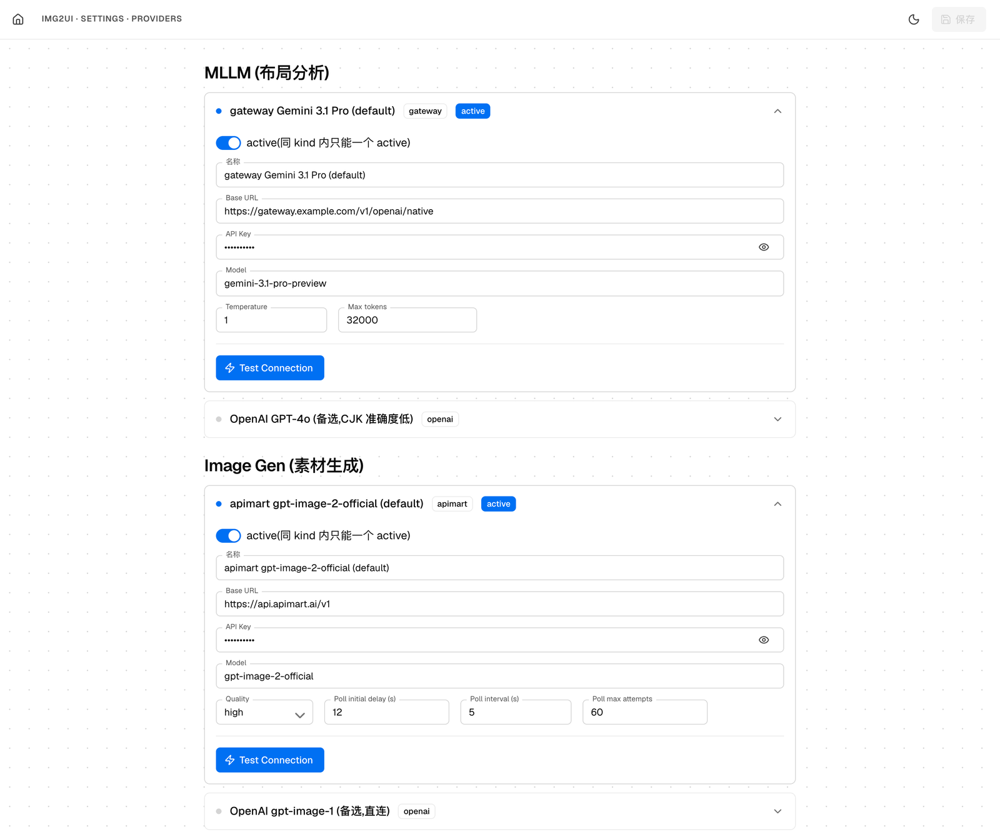
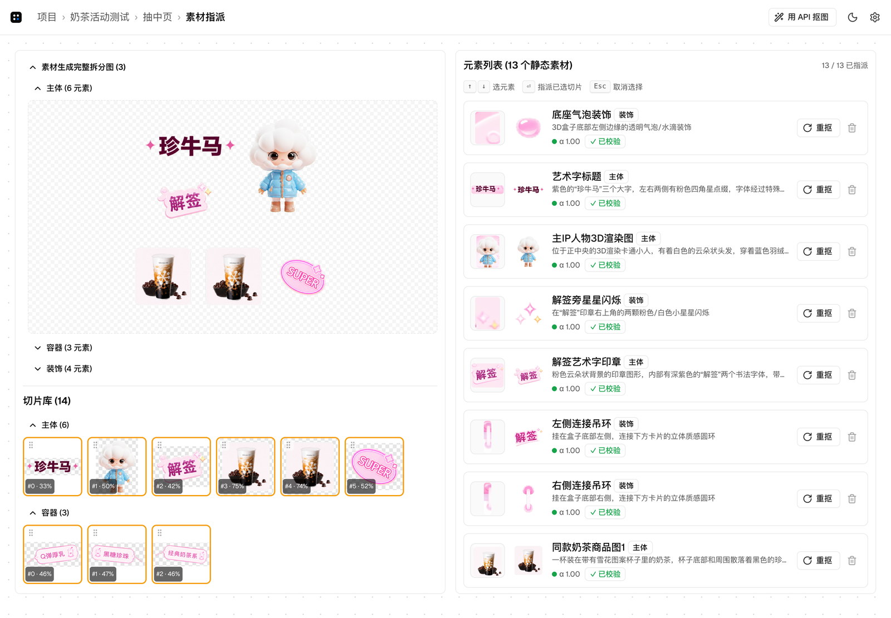

# img2UI

把 AI 生图设计稿(GPT-image-2 / Midjourney / 类似工具产物)转成 **coding agent** 可消费的素材包:**透明 PNG 资产 + bbox + 中文元素描述 + spec.md**。

不替代设计师,不替代 coding agent,只填补**生图工具 → 代码**之间这条链路里"栅格化 PNG 没有图层、没有语义"的缝隙。



一页跑完的样子:左边设计稿叠着 Pass 1 出的 bbox,右边 6 步流程走到最后的 导出,29 个元素已确认 / 13 个素材已指派。

---

## 形态

**本地 web app**(localhost-only,Next.js 15 + 文件系统 JSON 持久化)。一个进程跑起来,浏览器打开 http://localhost:3000,跟着 Pipeline 走完即可拿到导出文件夹。

```
设计稿 PNG ─┐
            ├─► Pass 1 (mllm 5 路并行布局分析)
            │   ↓
            │   Element Review(改 bbox / type / category / 描述,人 review)
            │   ↓
            ├─► Pass 2 (image_gen 6 路并行,绿幕 #00FF00 + 多参考图)
            │   ↓
            │   chroma green key + 切片(纯本地,0 API)
            │   ↓
            │   Asset Review(拖切片到 element,sub-crop,重抠)
            │   ↓
            ├─► 反向校验(mllm 评估 alpha_quality / contamination,不阻断)
            │   ↓
            ├─► 上传 CDN(可选)
            │   ↓
            └─► Export 文件夹: spec.md + assets/ + raw/ + manifest.json
                                ↓
                              coding agent 直接消费
```



上图 `Element Review` 那一步的实际界面:左边元素列表 + 分类筛选,中间直接在设计稿上拖 bbox,右边改 type / visual_category / 中文描述,`⏎` 确认后跳下一个,`⌘S` 保存。

## Setup

```bash
pnpm install
pnpm dev    # http://localhost:3000
```

首次启动会在 `data/config.json` 写入 default provider seed(api_key 全为空)。访问 `/settings/providers` 填:

| Provider | 必填? | 字段 |
|---|---|---|
| **sankuai Gemini 3.1 Pro** (mllm) | ✅ Pass 1 + 反向校验 | `api_key`(美团 AIGC gateway,不带 Bearer) |
| **apimart gpt-image-2-official** (image_gen) | ✅ Pass 2 + 单元素重抠 | `api_key`(标准 Bearer) |
| **koukoutu** (matting) | 可选 | Asset Review「用 API 抠图」按钮才用 |
| **Self-hosted S3** (cdn) | 可选 | `access_key_id` + `api_key` + `bucket` + `region` + `public_url_prefix`(导出时上传 CDN) |



`/settings/providers` 按 kind 分组,上表两个必填的 provider 长这样,同 kind 内只能一个 active。key 只写进本机 `data/config.json`,不进 git。

## Stack

- Next.js 15 (App Router) + React 19 + TypeScript strict
- MUI v6 + Emotion(Material Design 3 视觉,主色 Figma 蓝 `#0d99ff`)
- sharp(图像处理)+ nanoid(id)+ @aws-sdk/client-s3(CDN)+ sonner(toast)
- 无独立后端 / 无数据库 / 无 Tailwind / 无第三方 RNDR;Route Handler 直接调 lib

## 文档

- **`PLAN.md`** — 实施计划,§17 是 ASCII UI 草图,§16 决策固化清单
- **`CLAUDE.md`** — 后续 session 工作约束(实测收敛参数 + 反直觉硬约束)
- **`../img2UI-archive/HANDOFF.md`** — 产品契约 spec(prompt 模板逐字 / 反直觉硬约束 8 条 / provider 协议)。**必读**——任何"觉得更合理"的改写都会回归到 PoC 之前的失败状态

## 核心反直觉决策(§13)

- Pass 2 走 **image-edit** 多参考图,**不**走 text-to-image 重新生成(防风格漂)
- Pass 2 输出**不要求保持原坐标**(prompt 显式要求"留出空隙",防重叠区切片渗色)
- 异形容器是 **type=code**(用 SVG path / clip-path),不抠成 PNG(响应式需求)
- type 二分类(static / code),**不引第三类**(把复杂度甩给模型 + visual_category 正交维度)
- Pass 2 输出**绿幕 #00FF00 背景**,不让 model 出 transparent / 白底(白底抠会抠穿元素内白)
- 抠图**默认本地 chroma key**(0 API),koukoutu API 只作 Asset Review 用户手动 fallback
- Pass 1 走**5 路并行 over-include + IoU 合并**,**不**用 EXCLUSIVE 措辞(实测召回率从 69% 救到 92%)



上面这几条的产物在 Asset Review 里一次看全:顶部是 Pass 2 整张输出 chroma key 之后的拆分图(元素之间留了空隙,坐标不保原位),下面是切出来的 14 个切片(棋盘格是透明底,`#0 · 33%` 是不透明像素占比),右边 13 个元素全部指派完成,α 1.00。

## MVP 简化(`PLAN.md §0.4`)

- **每 page 只支持 1 张图**(UI 限制单 state,数据模型保留多 state 不动)
- Pass 1 后处理**过滤小元素**(相对面积 `< 0.001`,留底到 PipelineRun 可恢复)
- 切片库**全手动指派**(无独立 SliceManifest,Asset.slice_source 反查;Asset Review 拖切片到 element)

## 实测成本(MVP-α)

dogfood 472×1024 PNG 跑通完整 7 步:
- Pass 1: 45s · 5/5 路 · 51 raw → 29 元素
- Pass 2: 3min · **$0.519**(apimart gpt-image-2-official `quality=high`,3 个 visual_category)
- 反向校验 + 导出: < 1min · 13 切片全部指派
- **总计 ~$0.52 / 页**

## 开发

```bash
pnpm typecheck    # tsc --noEmit
pnpm build        # next build (production check)
pnpm lint         # next lint
```

数据目录布局见 `PLAN.md §11` / HANDOFF §11。`data/` 已 gitignored,clone 后首启动自动建。

## License

私有仓库,内部使用。
